<p align="center">
  
</p>

<h1 align="center">OpenTrip</h1>

<p align="center">
  <strong>一起规划行程，费用一键分摊。</strong>
</p>

<p align="center">
  面向小团队的协作式旅行规划工具 —— 地图行程、日程看板、共同账本、预订管理，
  以及一位懂行程的 AI 伙伴，全部集中在一处。
</p>

<p align="center">
  <a href="README.md">English</a> ·
  <a href="#功能">功能</a> ·
  <a href="#产品截图">产品截图</a> ·
  <a href="#快速开始">快速开始</a> ·
  <a href="#技术栈">技术栈</a>
</p>

<p align="center">
  
  
  
  
  
  
</p>

<p align="center">
  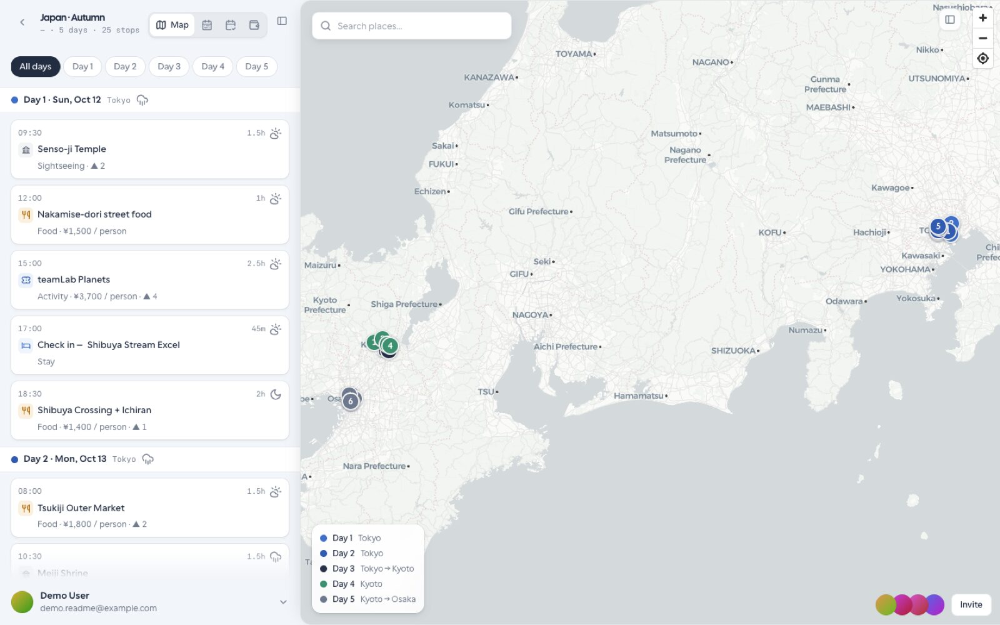
</p>

---

## 为什么选择 OpenTrip？

多人出行规划常常散落在群聊、表格和半更新的地图里。OpenTrip 把整趟旅程收进一个共享工作区：

- **看清路线** —— 实时地图上的站点、按天筛选、天气与地点搜索
- **管好日程** —— 按天的日程看板，时间与交通一目了然
- **分摊公道** —— 记账、余额与最少转账结算
- **一起决策** —— 投票、评论与邀请同行
- **问问 Agent** —— 懂当前行程的 AI 助手，需要时再出手

默认演示数据是 **Japan · Autumn（日本 · 秋日）** —— 东京 → 京都 → 大阪，5 天、25 个站点，以及完整费用账本。登录后即可直接体验。

---

## 功能

| | 能力 | 你能得到什么 |
| --- | --- | --- |
| 🗺️ | **地图行程** | 编号站点标记、按天路线、地点搜索、含投票与评论的站点详情 |
| 📅 | **日程看板** | 按天分列、站点卡片、交通段、天气提示 |
| 💰 | **账本与结算** | 共同支出、成员余额、最少转账路径、多币种展示 |
| 🎫 | **预订** | 把订单与确认状态放在行程旁边 |
| 🤖 | **行程 Agent** | 每个行程一份共享 AI 对话 —— 提问、建议、审批后写入 |
| 👥 | **协作** | 邀请链接、成员角色、站点投票、评论串 |
| 📱 | **桌面 + PWA** | 完整桌面规划器 + 移动优先 PWA（可安装；另提供微信小程序壳） |
| 🌐 | **国际化** | 中英文随时切换 |

---

## 产品截图

规划器截图使用 **Japan · Autumn** 演示行程。行程列表还会展示其它演示行程（冰岛、里斯本、巴厘岛）及 Unsplash 封面。

### 行程列表

一眼看到进行中的行程、封面图、成员与状态。

| 桌面端 (PC) | PWA 端 |
| :---: | :---: |
| 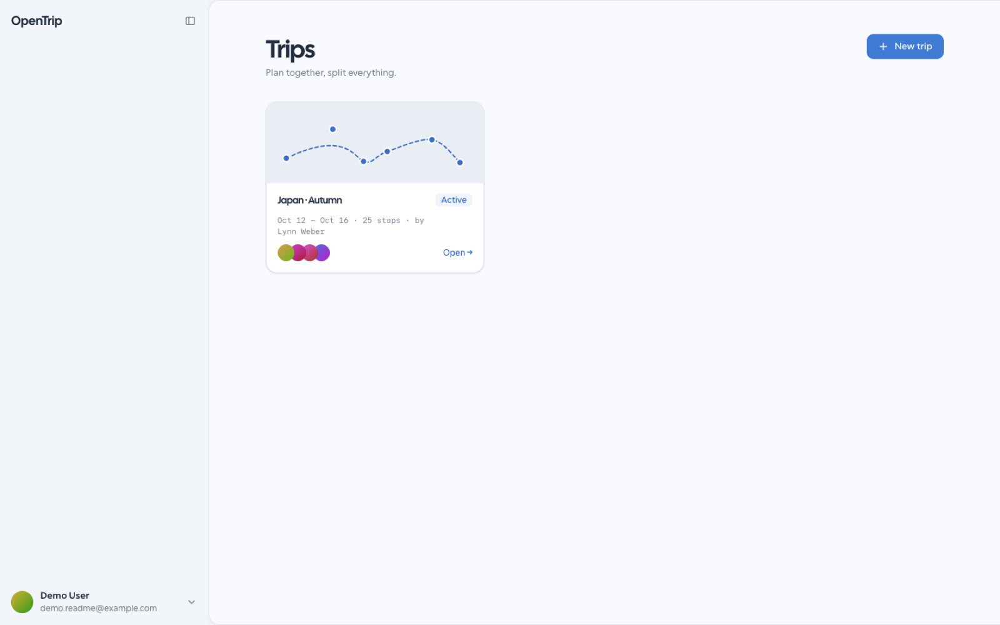 | 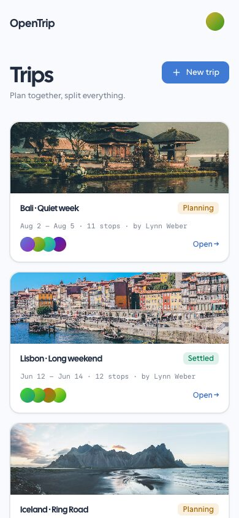 |

### 地图行程

在地图上规划路线 —— 按天筛选、打开站点、搜索地点。

| 桌面端 (PC) | PWA 端 |
| :---: | :---: |
|  | 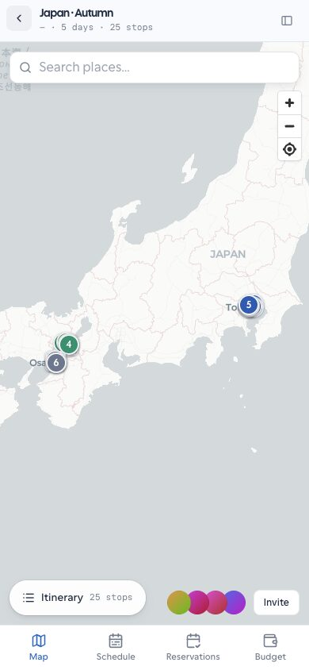 |

### 日程

按天排列的景点、美食、交通与住宿。

| 桌面端 (PC) | PWA 端 |
| :---: | :---: |
| 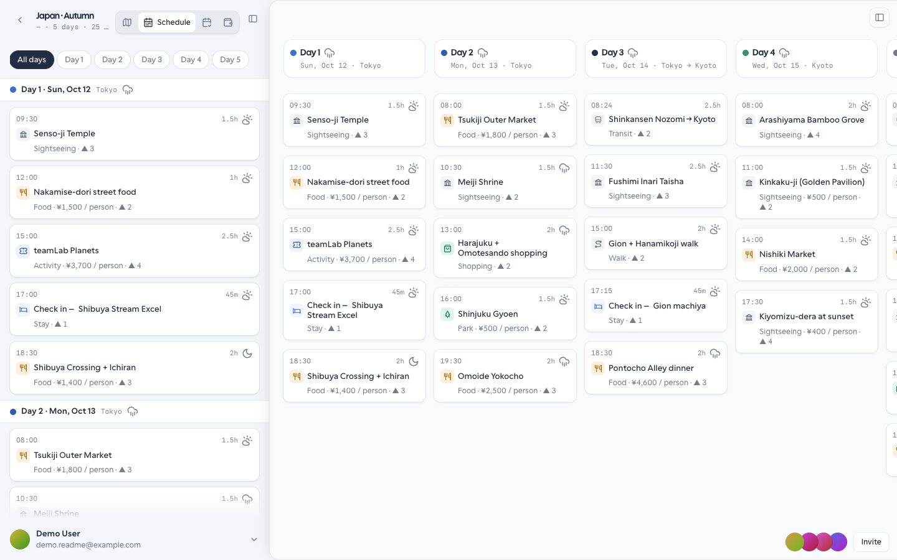 | 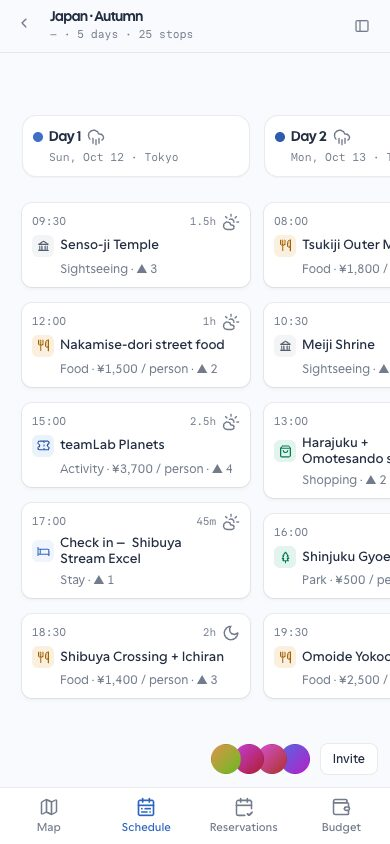 |

### 账本与结算

记录谁付了什么 —— OpenTrip 计算余额，并给出最少次转账的结算方案。

| 桌面端 (PC) | PWA 端 |
| :---: | :---: |
| 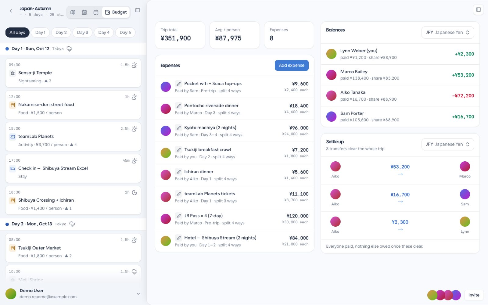 | 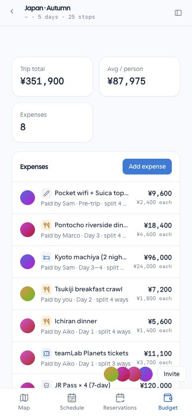 |

### 站点详情与协作

每个站点都有投票、评论、费用与天气。

<p align="center">
  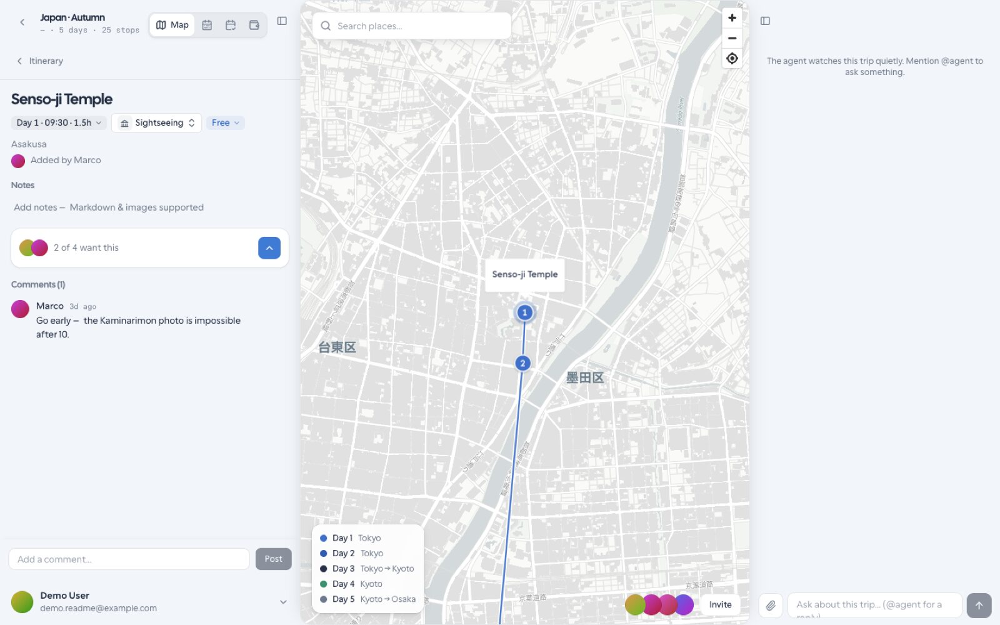
</p>

### 行程 Agent

共享的 AI 行程助手 —— 在对话里提问、查看建议、审批写入。

| 桌面端 (PC) | PWA 端 |
| :---: | :---: |
| 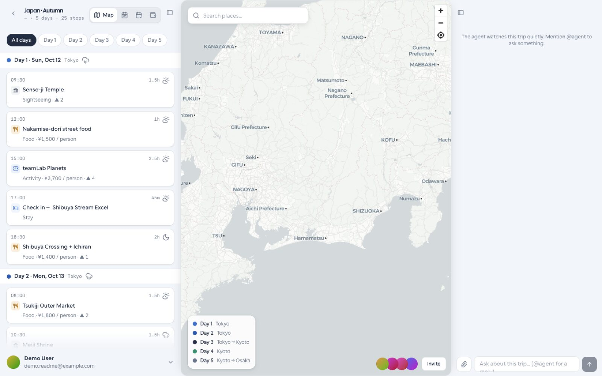 | 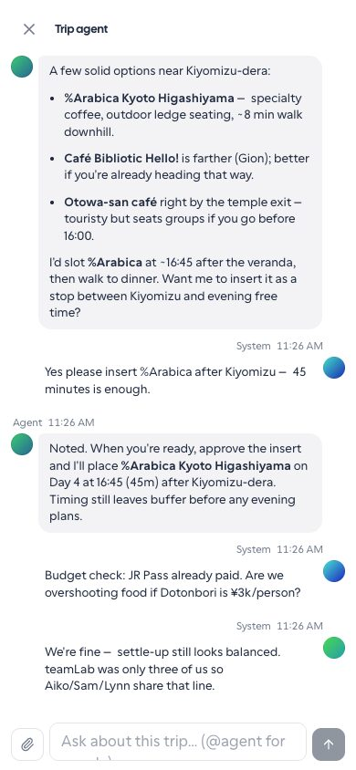 |

### 预订

把预订与行程放在一起，避免遗漏。

| 桌面端 (PC) | PWA 端 |
| :---: | :---: |
| 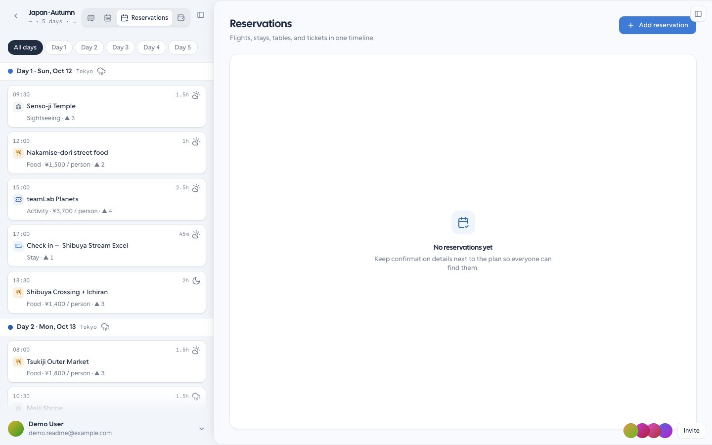 | 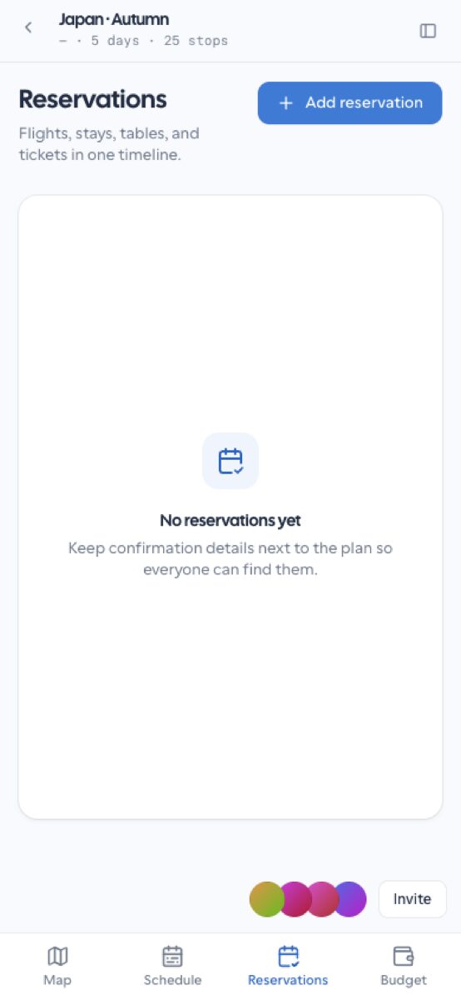 |

---

## 技术栈

| 层级 | 技术 |
| --- | --- |
| **Web** | React 19 · TypeScript · Vite · Feature-Sliced Design · Tailwind · MapLibre |
| **API** | Hono · 领域驱动设计 + 六边形架构 · Better Auth |
| **数据** | PostgreSQL · Prisma Migrate |
| **AI** | Vercel AI SDK · 行程级工具（需人工审批） |
| **运行时** | Cloudflare（Pages + Workers + Hyperdrive）或 Docker Compose |
| **客户端** | 响应式 SPA + PWA · 微信小程序 WebView 壳 |

---

## 快速开始

**环境要求：** Node.js ≥ 20、[pnpm](https://pnpm.io)、Docker（本地 Postgres）。

```bash
# 1. 安装与环境
make setup          # pnpm install、.env、Postgres、迁移、种子数据

# 2. 开发
make dev            # web → http://localhost:5170  ·  api → http://localhost:8780
```

在界面中注册账号。种子数据中的 **Japan · Autumn** 行程会立即可用，方便你体验完整规划器。

```bash
# 常用命令
make db-seed        # 重新写入演示行程
make check          # typecheck + lint + test + build
make deploy         # 部署说明入口（Cloudflare / Docker）
```

---

## 仓库结构

```
apps/
  web/          React SPA + PWA
  api/          Hono API（DDD / 六边形）
  miniapp/      微信原生壳（托管 PWA）
packages/       共享库（Agent UI catalog、可观测性）
deploy/         Cloudflare + Docker 部署配置
docs/           架构与运维说明
```

---

## 参与贡献

欢迎提交 Issue 与 Pull Request。请注意：

1. 代码、注释与提交信息使用 **英文**
2. 遵循 [Conventional Commits](https://www.conventionalcommits.org/) —— 例如 `feat(budget): add multi-currency settle-up display`
3. 开 PR 前运行 `make check`

---

## 许可证

采用 [Apache License 2.0](LICENSE)。

---

<p align="center">
  为结伴旅行的人而做 —— 让计划清晰，让分摊公平。
</p>
