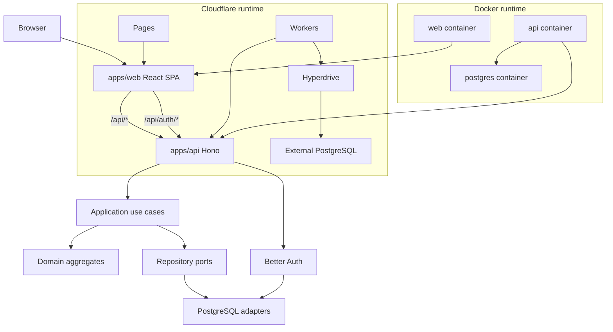

# Architecture

## Topology

## Layers

- **apps/web** — React SPA (FSD). Renders Trips and the Planner, talks to the
  API over `fetch`, and delegates auth to the Better Auth client.
- **apps/api** — Hono app (DDD + Hexagonal). `interfaces/http` routes call
  `application` use cases, which operate on `domain` aggregates through
  repository ports implemented in `infrastructure`.

## Request flow

1. The SPA calls `GET /api/trips` (credentials included).
2. Hono middleware resolves the Better Auth session; unauthenticated requests
   get `401`.
3. The route handler invokes a use case; the use case loads the aggregate via a
   repository port and returns a DTO.
4. The handler serializes the DTO with the shared response envelope.

## Auth flow

- The SPA uses the Better Auth React client against `/api/auth/*`.
- The API mounts `auth.handler` on `/api/auth/*`. Sessions are cookie-based;
  business routes read the session through shared middleware.

## Data flow

- All persistence is PostgreSQL. Better Auth and the domain repositories share
  one connection pool.
- Seed data mirrors the prototype (members, days, 22 stops, 8 expenses).

## Runtime differences (Cloudflare vs Docker)

| Concern | Cloudflare | Docker |
| --- | --- | --- |
| Frontend | Pages (`apps/web/dist`) | static container |
| API | Workers (`fetch` entry) | Node (`@hono/node-server`) |
| DB connection | Hyperdrive binding `connectionString` | `DATABASE_URL` |
| Secrets | `wrangler secret` / vars | env file |
| Avatar storage | S3-compatible API configured by env (R2) | persistent filesystem volume or S3-compatible API |

Both runtimes import the same `application`/`domain`/`infrastructure` code; only
the entry point and the connection-string source differ. See
[../operations/cloudflare.md](../operations/cloudflare.md) and
[../operations/docker.md](../operations/docker.md).

## Internationalization

The frontend is fully internationalized with `react-i18next` (English +
Chinese). All user-facing copy is centralized in locale resources. See
[../frontend/i18n.md](../frontend/i18n.md).
